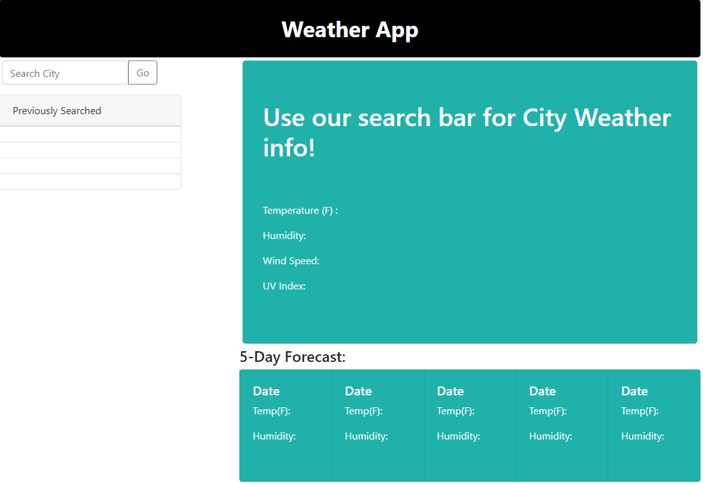

# WeatherApp
https://jesusfernandorios.github.io/WeatherApp/

# Functionality
This application gives the user weather information of a specific City. It includes information like Temperature, Humidity, and Wind speed. It will also give you UV information around the area of the city you are currently viewing. It also includes a future forecast that highlights the Temperature and Humidity for the next 5 days.

# Application Screenshot

